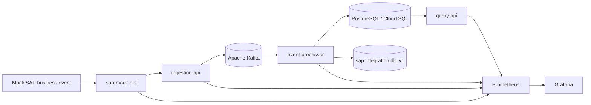

# Architecture Overview

## Purpose

This repository implements a realistic SAP-style integration platform on Google Cloud with Apache Kafka as the event backbone and PostgreSQL read models for API queries.

The platform is intentionally production-like but compact. It demonstrates senior platform engineering decisions without introducing fake complexity.

## High-Level Architecture

## Service Responsibilities

- `sap-mock-api`: simulates SAP-originated business payloads and can dispatch them to `ingestion-api`.
- `ingestion-api`: validates SAP payloads, normalizes them into canonical envelopes and publishes to Kafka.
- `event-processor`: consumes Kafka topics, enforces idempotency, persists PostgreSQL projections and sends non-recoverable messages to the DLQ.
- `query-api`: exposes read-only APIs over PostgreSQL projections.
- `notification-worker`: intentionally reserved for future fan-out and downstream notification scenarios.

## Canonical Event Envelope

Every business event is normalized to this envelope before Kafka:

- `event_id`
- `event_type`
- `version`
- `source`
- `occurred_at`
- `correlation_id`
- `payload`

This separates SAP edge payloads from internal event contracts and gives downstream processors a stable schema boundary.

## Kafka Topology

Topics:

- `sap.sales-orders.v1`
- `sap.customers.v1`
- `sap.invoices.v1`
- `sap.integration.dlq.v1`

Consumer groups:

- `sap-integration.event-processor.v1`
- `sap-integration.notification-worker.v1` reserved for future sales order and invoice fan-out

Partitioning strategy:

- sales orders: hash by `sales_order_id`
- customers: hash by `customer_id`
- invoices: hash by `invoice_id`
- DLQ: original partition key where available

Kafka headers:

- `event_id`
- `event_type`
- `version`
- `source`
- `correlation_id`
- `partition_key`
- DLQ metadata: `failure_reason`, `original_topic`, `original_partition`, `original_offset`, `original_key`

The topic catalog is source controlled under `platform/kafka/topic-catalog.yaml` and is used by Terraform to provision Managed Kafka topics on GCP.

## Idempotency And Processing

`event-processor` wraps each message in a PostgreSQL transaction:

1. validate envelope
2. insert `processed_events(event_id)` with `ON CONFLICT DO NOTHING`
3. stop if the event already exists
4. apply the domain projection
5. commit the transaction
6. commit the Kafka offset

This means duplicate Kafka delivery does not duplicate database writes.

## Error Handling

Transient errors:

- retried with bounded attempts and backoff
- counted in Prometheus metrics
- logged with event and correlation fields

Permanent errors:

- sent to `sap.integration.dlq.v1`
- recorded in `processed_events` with failure status when an event ID is available
- include original Kafka metadata for analysis and replay planning

## Persistence Model

PostgreSQL tables:

- `customers`
- `orders`
- `order_items`
- `invoices`
- `processed_events`

`processed_events` acts as both idempotency guard and audit trail.

## GCP Deployment Architecture

Terraform provisions:

- VPC, subnet, NAT and private service access
- GKE cluster with Workload Identity
- Cloud SQL PostgreSQL with private IP
- Artifact Registry repository
- Google service accounts for nodes and workloads
- Secret Manager secrets and IAM bindings
- Managed Service for Apache Kafka cluster, topics and ACLs

Helm deploys:

- Deployments and Services
- ConfigMaps
- service accounts and Workload Identity annotations
- secret references
- probes and resource limits
- HPA for `ingestion-api`
- optional Ingress and NetworkPolicy

## Observability Model

Each service exposes:

- `/health`
- `/ready`
- `/live`
- `/metrics`

Prometheus metrics cover:

- mock SAP events
- ingestion request outcomes
- Kafka publish outcomes and latency
- event processing outcomes
- retries
- DLQ writes
- query API request outcomes

Kafka consumer lag is documented and dashboard-ready through `kafka_consumergroup_lag`, which requires a Kafka exporter or managed metrics integration.

For local development, Prometheus and Grafana run through Docker Compose.

For GKE dev, the Helm chart can deploy a compact namespace-local Prometheus and Grafana pair. This is intentionally scoped to the application namespace and is meant for demos, smoke testing and interview review. A production environment can keep this disabled and rely on a shared observability platform instead.

## Security Baseline

- secrets are not committed
- `.tfvars`, `.env`, Terraform state and backend config are ignored
- Workload Identity avoids static service account JSON keys
- Secret Manager is the GCP secret source of truth
- Helm references Kubernetes Secrets rather than embedding values
- service accounts are split per workload
- Kafka ACLs are derived from topic and consumer group ownership
